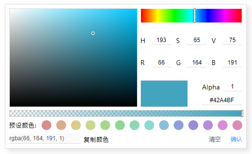

#### 颜色选择器

* <font size="2">封装颜色各种转换的格式函数: 如rgb2hsl、rgb2hsv、hsl2hsv、hsv2hsl、hsl2rgb、hsv2rgb、toHex、parseHexChannel等等，[颜色格式转换参考地址](https://en.wikipedia.org/wiki/HSL_and_HSV#Color_conversion_formulae)。</font>

* <font size="2">封装颜色类。包括初始化颜色值、颜色转换函数(通过上述封装好的颜色转换函数进行代理即可)、颜色格式化函数、更新颜色函数等。</font>

* <font size="2">创建各个区域的组件component。如拾色区域组件、色调区域组件、通用的输入框组件(可在这个组件中使用观察者模式，届时当颜色变化、透明度变化等等时，trigger即可)、显示颜色区域组件、透明度条区域，还可以额外扩展组件。这样每个文件中都有一个各自的组件，方便维护的同时，逻辑也很清楚，然后进行组合。</font>

* <font size="2">进行HTML布局，然后加上CSS样式，这个过程不需要借助canvas(使用canvas也可以)，只需普通的div就可以实现。需要注意的是拾色区域内的渐变颜色以及色调的渐变颜色，这个有讲究。</font>

    > <font size="2">Note: background-image最好加上浏览器厂商前缀</font>

    * <font size="2">拾色区域颜色渐变样式：</font>

        ```html
            <div class="pickUpArea"></div>
        ```

        ```css
            .pickUpArea {
                background-image: -moz-linear-gradient(bottom, #000 0%, rgba(0, 0, 0, 0) 100%), -moz-linear-gradient(left, #fff 0%, rgba(255, 255, 255, 0) 100%);
                background-image: -webkit-linear-gradient(bottom, #000 0%, rgba(0, 0, 0, 0) 100%), -webkit-linear-gradient(left, #fff 0%, rgba(255, 255, 255, 0) 100%);
                background-image: -ms-linear-gradient(bottom, #000 0%, rgba(0, 0, 0, 0) 100%), -ms-linear-gradient(left, #fff 0%, rgba(255, 255, 255, 0) 100%);
                background-image: -o-linear-gradient(bottom, #000 0%, rgba(0, 0, 0, 0) 100%), -o-linear-gradient(left, #fff 0%, rgba(255, 255, 255, 0) 100%);
                background-color: blue(随便设置的预设颜色);
            }
        ```

    * <font size="2">色调区域颜色渐变样式：</font>

        ```html
            <div class=hue></div>
        ```

        ```css
            .hue {
                background: -moz-linear-gradient(left, #f00 0%, #ff0 16.66%, #0f0 33.33%, #0ff 50%, #00f 66.66%, #f0f 83.33%, #f00 100%);
                background: -webkit-linear-gradient(left,#f00 0%, #ff0 16.66%, #0f0 33.33%,#0ff 50%, #00f 66.66%, #f0f 83.33%, #f00 100%);
                background: -ms-linear-gradient(left, #f00 0%, #ff0 16.66%, #0f0 33.33%, #0ff 50%, #00f 66.66%, #f0f 83.33%, #f00 100%);
                background: -o-linear-gradient(left, #f00 0%, #ff0 16.66%, #0f0 33.33%, #0ff 50%, #00f 66.66%, #f0f 83.33%, #f00 100%);
            }
        ```

* <font size="2">如果当前模式是以HSL模式初始化的，那么在算法的过程中需要转换成RGB模式外还需要转换为HSV模式，因为算法的过程中是以HSV模式为基准的。</font>

* <font size="2">当更新一些输入框的值、十六进制颜色、RGB颜色时也会需要Color类中的代理颜色转换方法。</font>

* <font size="2">如果把颜色选择器封装一个类的时候，可以暴露出一些回调。例如: 有一个清空按钮，那么需要恢复成初始化的时候的颜色。有一个确定按钮，代表用户已经选择好了颜色，那么触发一个回调，方便用户可以拿到这个颜色的值，以便于去给某个节点设置颜色等等。</font>

#### 拾色区域内算法

```javascript
    const width: number = 拾色区域的宽度
    const height: number = 拾色区域的高度
```

* <font size="2">根据鼠标当前在拾色区域内的坐标求得饱和度值：</font>

    ```javascript
        const saturation: number = ((x * 100) / width) | 0
    ```

* <font size="2">根据鼠标当前在拾色区域内的坐标求得明度值：</font>

    ```javascript
        const value: number = (100 - (y * 100) / height) | 0
    ```

* <font size="2">根据色相求得拾色区域内的小圆圈的X坐标：</font>

    ```javascript
        const x: number = ((saturation * width) / 100) | 0
    ```

* <font size="2">根据明度求得拾色区域内的小圆圈的Y坐标：</font>

    ```javascript
        const y: number = (height - (value * height) / 100) | 0
    ```

#### 更新色调算法

```javascript
    const width: number = 色调区域宽度
```

* <font size="2">根据鼠标滑动色调内滑块的X坐标求得色调：</font>

    ```javascript
        const x: number = Math.max(Math.min(e.clientX - left, width), 0)
        const hue: number = (360 * x / width) | 0
    ```

* <font size="2">根据当前色调值更新色调内滑块的位置：</font>

    ```javascript
        const x: number = (hue * width / 360) | 0
    ```

#### 更新透明度区域内的滑块算法

```javascript
    const width: number = 透明度区域宽度
    const sliderWidth: number = 滑块的总宽度
```

* <font size="2">根据鼠标在透明度区域内的X坐标求得颜色值：</font>
  
    ```javascript
        const x: number = Math.max(Math.min(e.clientX - left, width), 0)
        const distance: number = width - sliderWidth
        alphaSlider.style.left = Math.max(x - sliderWidth, -滑块的总宽度的一半) + 'px'

        // 得出滑块当前占透明度区域宽度的占比
        const alpha: number = x / distance
    ```

* <font size="2">当当前颜色color改变时更新透明度区域的颜色：</font>
  
    ```javascript
        const { r, g, b } = color
        alphaArea.style.backgroundImage = `linear-gradient(to right, rgba(${ r }, ${ g }, ${ b }, 0), rgb(${ r }, ${ g }, ${ b }))`
    ```

#### 预设颜色

* <font size="2">直接设置色调即可：</font>

    ```javascript
        // 假如想预设12个颜色，那么要算出每个颜色的角度为360 / 12 = 30°
        const length: number = 12

        for (let i: number = 0; i < length; i++) {
            // 由于是预设颜色，那么初始化的时候就不能改变当前的Color类，需要创建一个新的Color类，在这个类的基础上设置

            // 假如Color类有一个设置色调hue的方法叫setHue方法，那么需要在循环体内进行设置
            const newColor: Color = new Color()

            // 假如当前模式是HSL模式的话，需要设置一下Color类里的H、S、L属性，如果是HSV模式的话，同理。有了这个模式就可以转换成RGB模式的颜色了

            // 这里的setHSL的参数是初始化的参数，因为要设置色调，所以初始化给0，剩下的两个参数随意设置。如果想随机生成饱和度或亮度或明度时，可以使用Math.random函数
            /**
             * Note: 明度和亮度最大度数为100°

             * 例如有一个随机函数:
             * const isDecimal = (value) => /^\d+\.\d+$/.test(value + '')
             * const getRandomRange = (min, max) => {
                   if (isDecimal(min)) min = ~~min
                   if (isDecimal(max)) max = ~~max
                   return Math.floor(Math.random() * (max - min + 1)) + min
               }

             * 得出随机饱和度： const sat: number = getRandomRange(0, 100)
             * 得出随机明度或亮度： const value: number = getRandomRange(0, 100)
             */
            newColor.setHSL(0, 50, 70, color.alpha/* 透明度默认值为1 */)

            // 必须要取余360，因为色调的最大度数是360°
            newColor.setHue(i * 30 % 360)

            // 最后给预设颜色区域的每个节点设置颜色
            const { r, g, b } = newColor
            item.style.backgroundColor = `rgb(${ r }, ${ g }, ${ b })`
        }
    ```

#### 其他更新

* <font size="2">当当前颜色改变或透明度改变时，输入框以及显示颜色区域更新利用观察者模式进行更新。</font>

* <font size="2">显示颜色区域的颜色直接用当前设置的Color类中的RGBA颜色进行设置，当透明度改变时就不需要修改了。</font>

#### 效果展示


